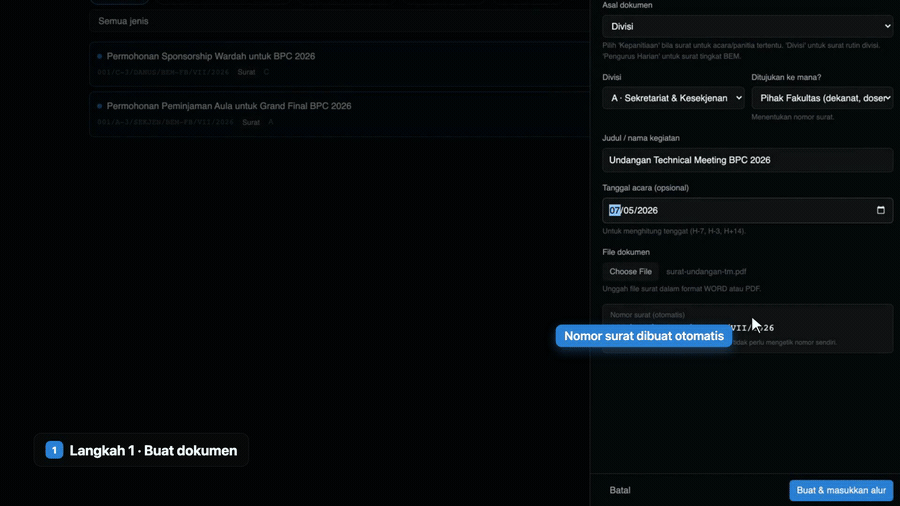
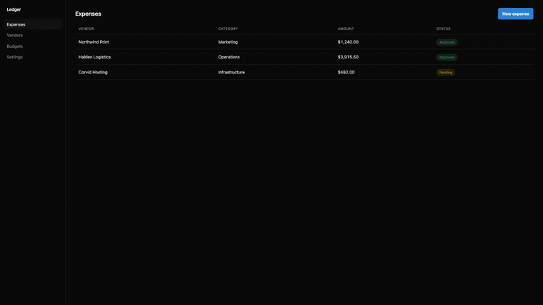

# reshoot

Record a real browser once. Draw the cursor, the zoom and the labels afterwards, in code.



Playwright records the screen with the cursor deliberately absent from the frame, and
writes a timeline of everything the script did: every click, keystroke and scroll,
with millisecond timestamps and pixel coordinates. Remotion then draws the cursor from
that timeline at render time.

The consequence is the whole point. Cursor speed, click pulses, zoom, callout labels
and how long a shot holds are all editing decisions rather than recording decisions.
Changing any of them costs a re-render, not another take. The clip above is an excerpt from a
real product tutorial built this way.

## Try it

```bash
git clone https://github.com/GJI9/reshoot && cd reshoot
npm install
npx playwright install chromium
npm run example:record   # records example/app into public/captures
npm run studio           # opens Remotion Studio, scrub and edit live
npm run render           # writes out/demo.mp4
```

`example/app` is a small static page so the example runs with no server and no
account. Point `example/record.mjs` at your own dev server and rewrite the middle.



## Recording

```js
import { Recorder } from './record/recorder.mjs';

const rec = await Recorder.start({ name: 'signup', outDir: 'public/captures' });

await rec.goto('http://localhost:5173/signup');
await rec.type('input[name=email]', 'ada@example.com', { label: 'Work email' });
await rec.select('#plan', 'Team', { label: 'Plan' });
await rec.click('button[type=submit]', { label: 'Create account' });
await rec.dwell(1500);

await rec.finish();
```

That writes `signup.webm` and `signup.events.json`. Every method takes a CSS selector,
a Playwright locator or a raw `{x, y}`.

| | |
|---|---|
| `goto(url)` | navigate and wait for the page to settle |
| `move(target)` | move the cursor without clicking |
| `click(target, {label, noAct})` | `noAct` animates the click without firing it, for buttons you want to show but not press |
| `clickText(text)` | click by visible text |
| `type(target, text, {label, delay})` | types character by character, never instant |
| `select(target, value)` | choose from a `<select>` |
| `prefill(target, value)` | fill instantly and log nothing, for pre-roll setup you intend to trim |
| `scroll(toY, {ms})` | smooth continuous scroll |
| `scrollTo(target)` | scroll an element into the middle of the frame |
| `dwell(ms)` | hold still |
| `flashMarker()` | flash two magenta frames as a frame-accurate anchor |

`label` is what appears in the pill next to the cursor. Leave it off and nothing is
drawn.

## Compositing

One recorded take is one `<Scene>`:

```tsx
<Scene
  clip="captures/signup.webm"
  events={take.events}
  trim={45}          // frames off the front: browser startup, login, setup
  play={s(8.9)}      // freeze here and hold, for a longer beat than you recorded
  index="1"
  title="Create an account"
  zoom={{ scale: 1.35, auto: { axis: 'x', from: 1180, to: 1460 }, followY: true }}
/>
```

`zoom.auto` ramps the zoom in only while the cursor is inside a region, so one take can
cover a full-width list and a narrow side panel without cutting between two shots. The
cursor walking back out of the panel pulls the camera back out with it.

`trim` and `play` are why takes do not need to be clean. Record the login, trim it off.
Record a rushed final beat, freeze early and hold. The recording is raw material.

Colours, the accent and the font live in `src/theme.ts`. The cursor, the pill and the
chapter title are ordinary React components in `src/`, so anything you can render, you
can pin to a cursor position.

## What it does not do

It records what the browser paints, so native file pickers, OS dialogs and browser
chrome are not in the frame. Chromium only. No audio: Remotion's `<Audio>` handles
narration and music, and this repo has no opinion about it.

The overlay is aligned to the recorder's wall-clock timestamps rather than to decoded
frames. That has held up across three-minute takes here, but if you ever see the cursor
drift against the video on a long one, `flashMarker()` gives you a visible anchor to
line the layers up against.

## Licence

MIT.
